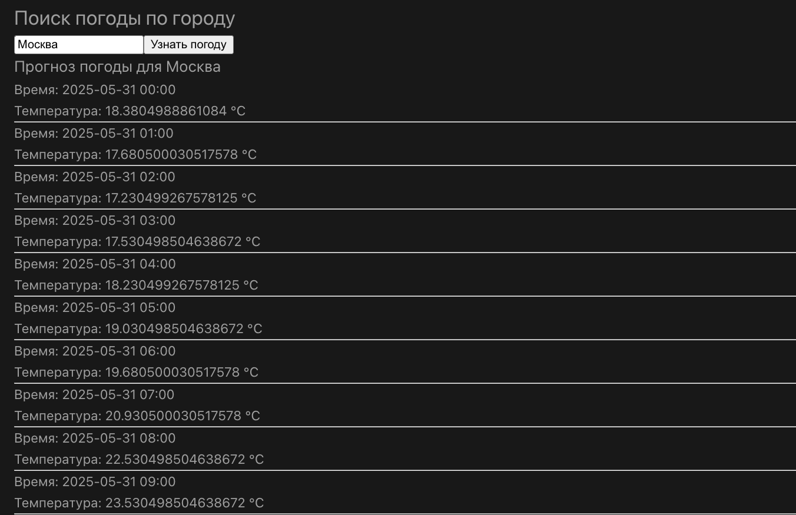
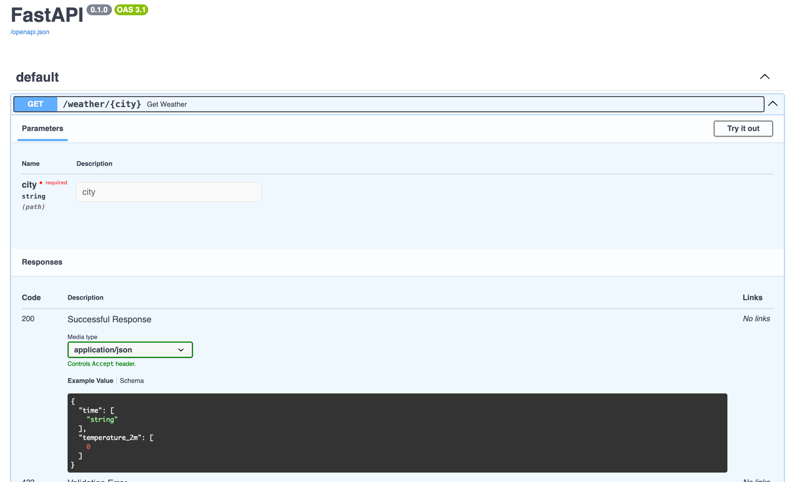

# Meteocatsapi

Сделаны все тестовые задания.

Meteocatsapi — это простой веб-сервис на FastAPI и Vue.js, предназначенный для получения прогноза погоды по названию города.
Небольшой веб сервис для получения погоды через API

## Используемые API
2GIS API — предоставляет координаты (широту и долготу) по названию населённого пункта и поддерживает автодополнение.
https://dev.2gis.ru/api
https://platform.2gis.ru/ru?utm_source=dev_2gis&utm_medium=button_main&utm_campaign=API_NAVI - сайт для получения ключа
open-meteo.com — возвращает прогноз погоды по координатам.
https://open-meteo.com/

## Особенности
Backend реализован с использованием FastAPI.
Простая интеграция с frontend, написанным на Vue.js.
Предустановленный тестовый ключ для 2GIS находится в .env.example.
FastAPI работает на порту 8123, который используется во frontend. Изменение порта не рекомендуется.

2GIS предоставляет получение latitude и longitude, что важно для дальнейшей работы
с сайтом open-meteo.com, который ожидает получения этих данных. Также 2GIS предоставляет API для автодополнения при
наборе населённых пунктов.

В файле .env.example находится уже готовый тестовый ключ для взаимодействия с API.

Помимо работы над получением данных и обработки в FastAPI у сервиса также есть простая связка с frontend написанным на Vue.js.
Для корректной работы не рекомендуется менять стандартный порт FastAPI(8123) поскольку Vue стучит на этот порт по адресу.
http://localhost:8123/weather/{city}

## Структура URL
Backend API: http://localhost:8123/weather/{city}

Frontend (Vue.js): http://localhost:5174/

## Локальный запуск
1. создать файл .env
```bash
touch .env
```
2. скопировать в него содержимое из файла .env.example (мануально или командой в терминале)

```bash
cp .env.example .env
```

3. Перейдите в директорию backend и установите зависимости:

```bash
cd backend
pip install -r requirements.txt
```

4. Не забудьте создать и активировать venv (через poetry или python)
5. Находясь в директории запустить python3 -m app (если мак) или python -m app(на других устройствах)

```bash
python3 -m app   # для macOS / Unix
python -m app    # для Windows
```
## FrontEnd локально
1. Для запуска фронтенда перейдите по пути /frontend/forecastapi
запустите:

```bash
npm install
npm run build
npm run dev
```


## Для запуска приложения из докера

1. создайте и заполните .env файл по той же инструкции, что и для локального сервера
```bash
touch .env
 ```

2. запустите docker-compose build из root директории 
```bash
docker-compose build
```
3. Дождавшись загрузки образа напишите docker-compose up

```bash
docker-compose up
```

## После запуска:
Backend: http://0.0.0.0:8123/
Frontend: http://localhost:8080/ 
Документация FastAPI: http://0.0.0.0:8123/docs
Прогноз погоды: http://0.0.0.0:8123/weather/{city}

## Тестирование
Рекомендую протестировать API через встроенную документацию OpenAPI по адресу:
http://0.0.0.0:8123/docs

